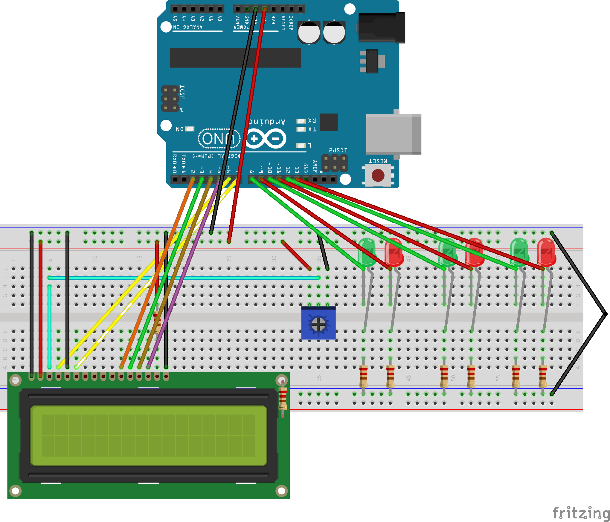

# Project Overview

This project is a traffic simulator that runs on an Arduino Uno using the ChibiOS/RT operating system.

## Setup Instructions

1. Download ChibiOS v21.11.3 or later.

2. **Makefile Adjustments**  
   Modify the `Makefile` according to your specific setup. Common adjustments include:
   - Setting the correct `tty` for your Arduino board.
   - Adjusting the relative path to the ChibiOS main directory.

3. **Apps Folder**  
   Create a folder inside the main ChibiOS directory and paste this project inside it.

4. Connect the pins and LEDs as referenced in the schematic below, or modify the pins in `traffic.h` as needed.

5. Connect the Arduino using a serial monitor. The Arduino IDE is recommended due to its ability to send strings.
	
## Recommended Circuit Schematic

## How to Use

1. Commands sent via serial must be formatted as follows:
   - The first character must indicate the lane number:
     - `0` for the primary lane (or use `'C'` or `'A'` for vehicles)
     - `1` for the secondary lane
     - `2` for the pedestrian lane
   - For the primary and secondary lanes, you can specify up to 7 vehicles:
     - Use `'C'` for normal cars
     - Use `'A'` for ambulances
   - For the pedestrian lane, you can only use `'P'` for pedestrians.

## Traffic Rules

Only one traffic light will be green at any time. The rules for the green light follow the guidelines below:

- The natural order of the green light is: primary, pedestrian (if there are pedestrians), secondary (if there are cars), and back to primary. However, the pedestrian light must not be green two times in a row if there are cars in the secondary lane;
- Ambulances will move ahead of cars in front of them, even if the traffic light is red;
- If there is an ambulance in the primary lane, the light will turn green within a maximum of 2 seconds, and it will stay green until there are no more ambulances;
- If there is an ambulance in the secondary lane, the light will turn green within 2 seconds or wait until all ambulances in the primary lane have passed;

After the green light, the light will blink at a frequency of 1 Hz, indicating the yellow light.

## Requirements
- **Hardware:** Arduino Uno
- Software: ChibiOS v.21.11.3+/RT
